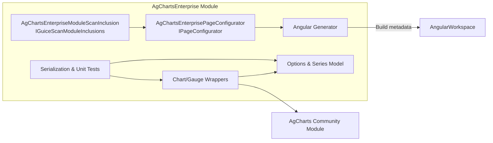

# C4 Level 3 — Components (AgChartsEnterprise Module)

Focus: internal components inside `com.jwebmp.plugins.agchartsenterprise` and how they collaborate.

Component responsibilities
- `AgChartsEnterprisePageConfigurator`: owner of dependency wiring; minimal runtime logic beyond annotation-driven metadata.
- `AgChartsEnterpriseModuleScanInclusion`: guarantees the module participates in classpath scanning even when shaded/merged.
- `Chart/Gauge Wrappers` + `Options Model`: provide fluent Java APIs that ultimately serialize to AG Charts Enterprise configuration.
- Tests ensure forward-only confidence without touching generated TypeScript outputs.
