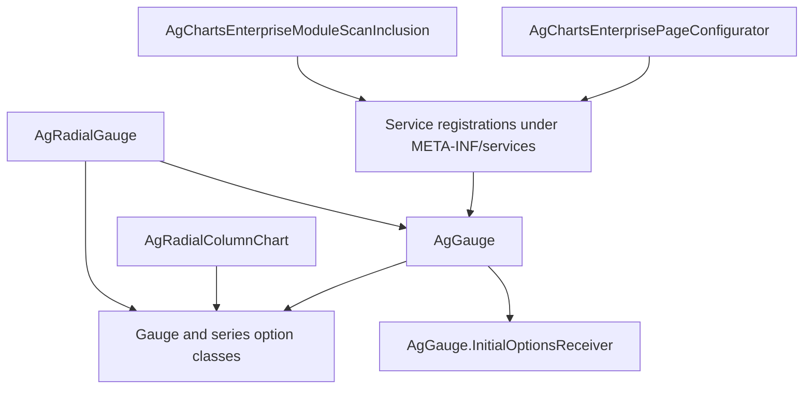

# C4 Level 3 — Components (Ag Charts Enterprise)

Component view derived from `AgGauge`, `AgRadialGauge`, `AgRadialColumnChart`, and the JPMS/service registrations.

```mermaid
graph TD
    PageConfigurator[AgChartsEnterprisePageConfigurator]
    ModuleScan[AgChartsEnterpriseModuleScanInclusion]
    InitialOptionsReceiver[AgGauge.InitialOptionsReceiver]
    GaugeBase[AgGauge]
    RadialGauge[AgRadialGauge]
    RadialColumn[AgRadialColumnChart]
    Options[Gauge and series option classes]
    Services[Service registrations under META-INF/services]

    PageConfigurator --> Services
    ModuleScan --> Services
    Services --> GaugeBase
    GaugeBase --> InitialOptionsReceiver
    RadialGauge --> GaugeBase
    RadialColumn --> Options
    GaugeBase --> Options
    RadialGauge --> Options
```

Highlights
- `AgChartsEnterprisePageConfigurator` exposes plugin metadata, Angular imports, and declares the ag-charts-enterprise dependency.
- `AgGauge` implements `INgComponent` integration, wires EventBus fields/methods via `AnnotationUtils`, and registers a WebSocket receiver for initial options.
- `AgRadialGauge` supplies default gauge options with scale min/max using CRTP setters.
- `AgRadialColumnChart` builds polar axes and a radial column series for AG Charts, returning options via Mutiny `Uni`.
