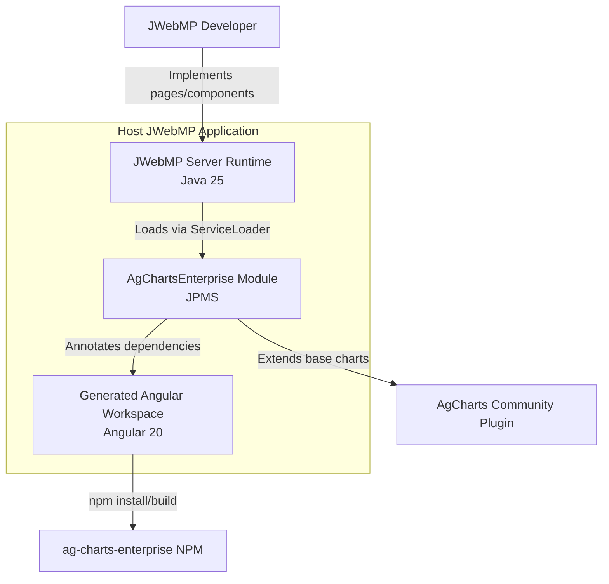

# C4 Level 2 — Containers

Purpose: detail the primary containers that collaborate when the plugin is present in a host JWebMP application.

Notes
- The plugin is packaged as its own Java module but is loaded into the host server container via JPMS and ServiceLoader.
- The generated Angular workspace is not committed; it is a build output that consumes dependency metadata emitted by the plugin.
