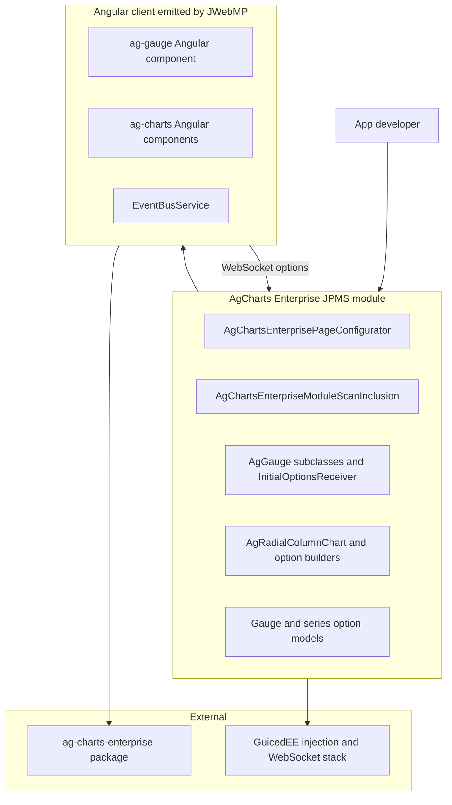

# C4 Level 2 — Containers

Container view based on module exports, Angular annotations, and WebSocket receivers in `AgGauge`.

```mermaid
graph TD
    subgraph ServerModule[AgCharts Enterprise JPMS module]
        PageConfigurator[AgChartsEnterprisePageConfigurator]
        ModuleScan[AgChartsEnterpriseModuleScanInclusion]
        GaugeServer[AgGauge subclasses and InitialOptionsReceiver]
        ChartServer[AgRadialColumnChart and option builders]
        OptionsModels[Gauge and series option models]
    end

    subgraph ClientRuntime[Angular client emitted by JWebMP]
        GaugeComponent[ag-gauge Angular component]
        ChartComponent[ag-charts Angular components]
        EventBusClient[EventBusService]
    end

    subgraph External
        AGChartsNpm[ag-charts-enterprise package]
        GuicedEE[GuicedEE injection and WebSocket stack]
    end

    Developer[App developer] --> ServerModule
    ServerModule --> ClientRuntime
    ClientRuntime --> AGChartsNpm
    ClientRuntime -->|WebSocket options| ServerModule
    ServerModule --> GuicedEE
```

Notes
- Page configurator registers Angular imports and the ag-charts-enterprise dependency so the client runtime can load resources.
- `AgGauge` registers a WebSocket receiver (`InitialOptionsReceiver`) that pulls options from Guice-managed instances when the Angular component requests configuration.
- `AgRadialColumnChart` assembles axes/series options asynchronously (`Uni`) for the client-side chart component.
