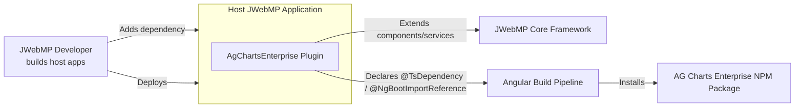

# C4 Level 1 — Context

Purpose: show how the AgChartsEnterprise JWebMP plugin fits into the surrounding ecosystem (developers, host apps, build pipeline, and AG Charts Enterprise distribution).

Key points
- Plugin operates inside a host JWebMP app but drives both server behavior (wrappers) and client generation (Angular workspace).
- Angular build relies solely on metadata emitted by the plugin; no manual TypeScript edits are required.
