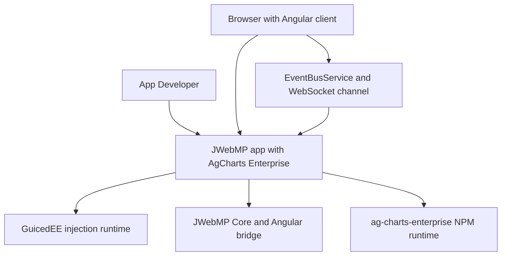

# C4 Level 1 — System Context

Grounded in `src/main/java/module-info.java` and service registrations under `src/main/resources/META-INF/services/`, the plugin supplies enterprise charting capabilities to host JWebMP applications and ships Angular bindings plus TypeScript dependencies.

```mermaid
graph TD
    Developer[App Developer] --> HostApp[JWebMP app with AgCharts Enterprise]
    HostApp --> GuicedEE[GuicedEE injection runtime]
    HostApp --> JWebMP[JWebMP Core and Angular bridge]
    HostApp --> AGChartsJS[ag-charts-enterprise NPM runtime]
    Browser[Browser with Angular client] --> HostApp
    Browser --> EventBus[EventBusService and WebSocket channel]
    EventBus --> HostApp
```

Key points
- The module `com.jwebmp.plugins.agchartsenterprise` is JPMS-exported and auto-discovered via `IPageConfigurator` and `IGuiceScanModuleInclusions`.
- Frontend dependencies are declared via `@TsDependency` and Angular boot import references in `AgChartsEnterprisePageConfigurator`.
- Gauge and chart components rely on the JWebMP Angular runtime and WebSocket-backed EventBus to fetch options from the server.
