# ERD — Gauge and Series Option Models

Relationships captured from classes under `src/main/java/com/jwebmp/plugins/agchartsenterprise/options`.

```mermaid
erDiagram
    AgRadialGaugeOptions ||--|| AgRadialGaugeScale : has
    AgRadialGaugeOptions ||--|| AgRadialGaugeBarStyle : has
    AgRadialGaugeOptions ||--|| AgRadialGaugeNeedleStyle : has
    AgRadialGaugeOptions ||--|| AgRadialGaugeLabelOptions : has
    AgRadialGaugeOptions ||--|| AgRadialGaugeSecondaryLabelOptions : has
    AgRadialGaugeOptions ||--|{ AgRadialGaugeTarget : targets
    AgRadialGaugeOptions ||--|| AgGaugeSegmentation : segmentation
    AgGaugeSegmentation ||--|{ AgGaugeColorStop : colors
    AgRadialGaugeScale ||--|| AgRadialGaugeScaleLabelOptions : labels
    AgGaugeSegmentation ||--|| AgGaugeSegmentationInterval : interval

    AgLinearGaugeOptions ||--|| AgLinearGaugeScale : has
    AgLinearGaugeOptions ||--|| AgLinearGaugeBarStyle : has
    AgLinearGaugeOptions ||--|| AgLinearGaugeLabelOptions : has

    AgRadialColumnSeriesOptions ||--|| AgPolarAxisLabelOptions : label
    AgRadialColumnSeriesOptions ||--|| AgRadiusNumberAxisOptions : radiusAxis
    AgRadialColumnSeriesOptions ||--|| AgAngleCategoryAxisOptions : angleAxis
    AgHeatmapSeriesOptions ||--|| AgHeatmapSeriesLabelOptions : label
```

Notes
- Option classes follow CRTP fluent setters returning `(J)this`.
- Gauge options embed multiple style/value objects to mirror AG Charts Enterprise configuration.
- Series options extend AG Charts base options while adding enterprise-specific properties (heatmap, radial column).
