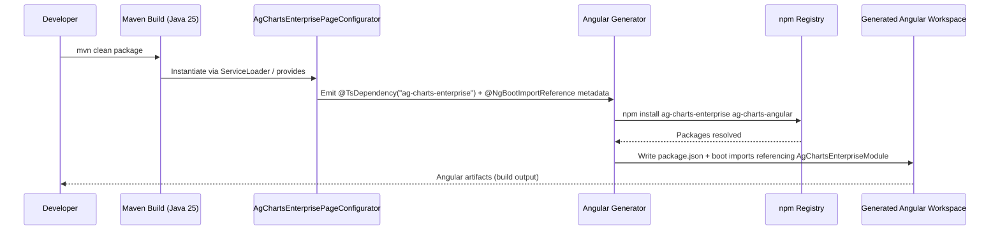

# Sequence — Build Integration (Page Configurator → Angular)

Shows how the enterprise dependency is wired into the generated Angular workspace during a build.

Highlights
- No manual TypeScript edits are required; annotations drive the generator.
- The generator fetches both the enterprise runtime and the Angular bridge (`ag-charts-angular`) so imports stay in lockstep.
- Build outputs remain read-only; the authoritative sources are the Java configurator and option models.
