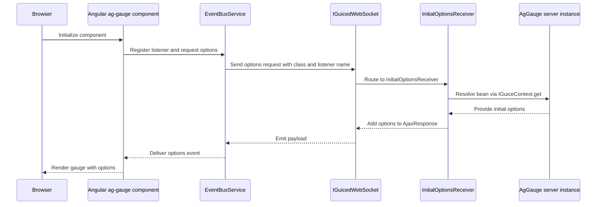

# Sequence — Gauge Options Fetch

Flow based on `AgGauge` annotations and `InitialOptionsReceiver` resolving options via Guice/WebSocket.

```mermaid
sequenceDiagram
    participant Browser as Browser
    participant GaugeComponent as Angular ag-gauge component
    participant EventBus as EventBusService
    participant WebSocket as IGuicedWebSocket
    participant Receiver as InitialOptionsReceiver
    participant GaugeServer as AgGauge server instance

    Browser->>GaugeComponent: Initialize component
    GaugeComponent->>EventBus: Register listener and request options
    EventBus->>WebSocket: Send options request with class and listener name
    WebSocket->>Receiver: Route to InitialOptionsReceiver
    Receiver->>GaugeServer: Resolve bean via IGuiceContext.get
    GaugeServer-->>Receiver: Provide initial options
    Receiver-->>WebSocket: Add options to AjaxResponse
    WebSocket-->>EventBus: Emit payload
    EventBus-->>GaugeComponent: Deliver options event
    GaugeComponent-->>Browser: Render gauge with options
```
