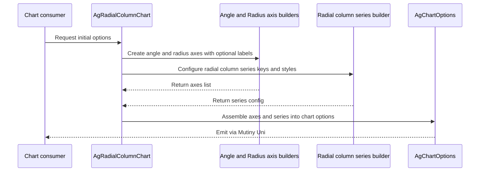

# Sequence — Radial Column Options Assembly

Flow inferred from `AgRadialColumnChart#getInitialOptions()` returning `Uni<AgChartOptions<?>>` with axis/series wiring.

```mermaid
sequenceDiagram
    participant Caller as Chart consumer
    participant RadialColumn as AgRadialColumnChart
    participant Axes as Angle and Radius axis builders
    participant Series as Radial column series builder
    participant Options as AgChartOptions

    Caller->>RadialColumn: Request initial options
    RadialColumn->>Axes: Create angle and radius axes with optional labels
    RadialColumn->>Series: Configure radial column series keys and styles
    Axes-->>RadialColumn: Return axes list
    Series-->>RadialColumn: Return series config
    RadialColumn->>Options: Assemble axes and series into chart options
    Options-->>Caller: Emit via Mutiny Uni
```
